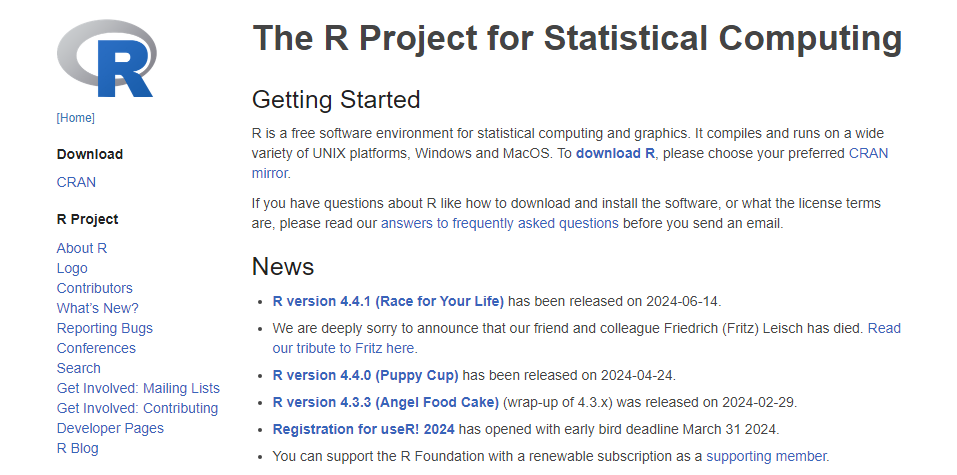
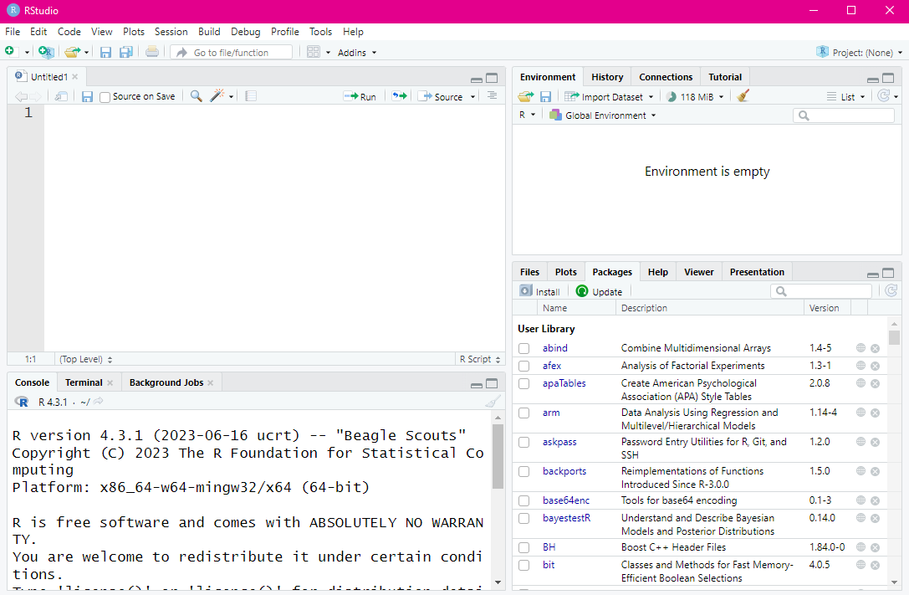
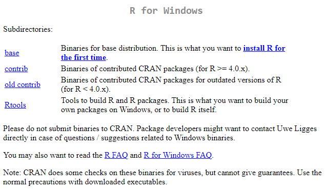
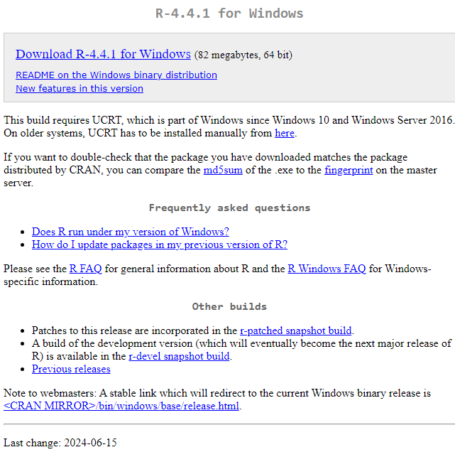
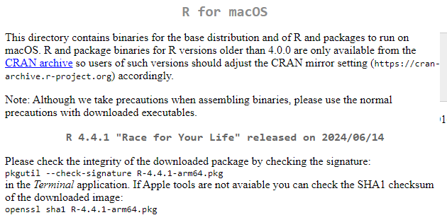
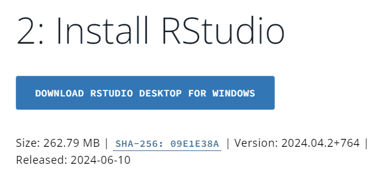
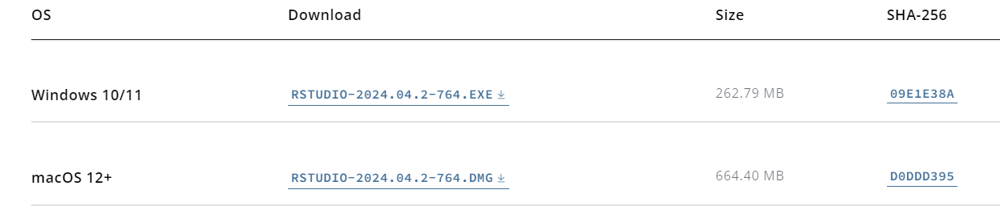
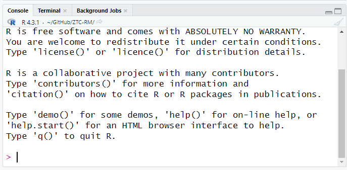
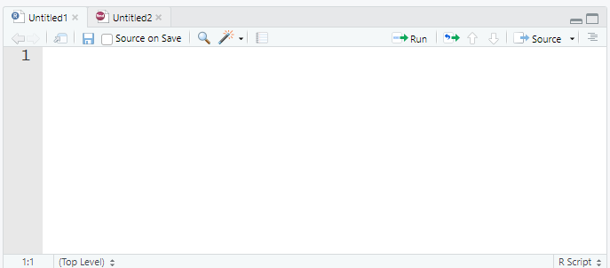
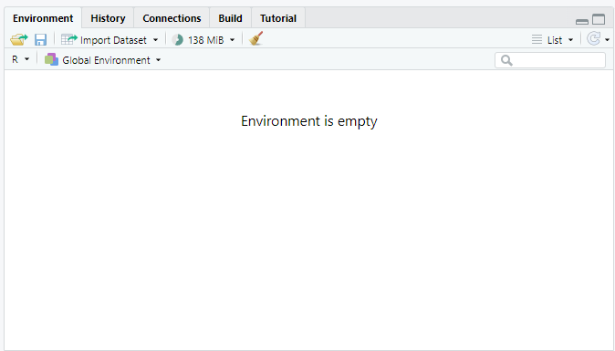

# Introduction to R and R Studio

Welcome to the beginning of your journey into the world of statistical analysis with R and R Studio.
This section will introduce you to the fundamental concepts and tools you'll use throughout this course to explore and analyze data.

## What is R?

R is a powerful statistical programming language used widely by statisticians, data scientists, and researchers to analyze and visualize data.
It's open source, which means it is free to use, and has a vast community of users and developers who contribute to its continuous development.

 *Screenshot of the R Project homepage, where R can be downloaded.*

### Features of R

-   **Statistical Analysis**: Provides a wide array of techniques for data analysis, including linear and nonlinear modeling, classical statistical tests, time-series analysis, classification, clustering, and more.
-   **Graphics**: Boasts high-quality graphics capabilities that allow for the creation of well-designed publications and interactive visualizations for the web.
-   **Packages**: Comes with a comprehensive ecosystem of packages, available through the Comprehensive R Archive Network (CRAN), which extend R's capabilities to handle tasks related to psychological research and beyond.
-   **Programming**: Supports both procedural programming with functions and object-oriented programming with generic functions.
-   **Community Support**: Has a large, active community offering support through mailing lists, forums, and blogs.

## What is R Studio?

R Studio is an integrated development environment (IDE) for R.
It provides a user-friendly interface that makes using R easier and more efficient.
R Studio includes a console, syntax-highlighting editor that supports direct code execution, and tools for plotting, history, debugging, and workspace management.

 *Overview of the R Studio interface.*

### Why Use R Studio?

-   **Ease of Use**: The R Studio environment organizes everything you need to write code, visualize data, and debug errors in one place.
-   **Productivity Tools**: Features like code completion, snippets, and the ability to directly output graphs enhance productivity.
-   **Project Management**: Simplifies the process of managing files associated with specific projects, making it easy to handle multiple, complex research projects.
-   **Reproducibility**: Encourages reproducible research by integrating well with R Markdown, which allows you to create dynamic reports that blend R code with narrative text and output.

## R and R Studio in Psychological Research

In psychological research, R and R Studio play a critical role in: - **Data Collection and Cleaning**: Handling and cleaning raw data from experiments or surveys.
- **Statistical Testing**: Performing t-tests, ANOVA, regression analyses, and more sophisticated statistical models.
- **Data Visualization**: Creating compelling visualizations to explore data trends and communicate results.
- **Reproducible Research**: Producing reproducible analyses that can be shared and verified by others, enhancing the transparency and credibility of research findings.

 *Example of a data visualization created in R.*

In the next sections, we will guide you through installing R and R Studio on your system and begin exploring their capabilities through practical exercises.
This foundation will set you up for success as you dive deeper into the statistical techniques and tools that will be covered throughout this course.

## Installing R

To utilize R and R Studio for your statistical analysis, the first step is to install R.
R is the underlying statistical computing environment, while R Studio provides an integrated development environment (IDE) for R.
Below are the detailed instructions for installing R on Windows and macOS.

### Installing R on Windows

Follow these steps to install R on a Windows computer:

1.  **Visit the CRAN Website**: Go to the Comprehensive R Archive Network (CRAN) at <https://cran.r-project.org>.
    This website hosts the R software and its documentation.

2.  **Download R for Windows**: Click on the link titled "Download R for Windows".
    This will take you to the Windows download page.

    

3.  **Install R Base**: On the download page, click "install R for the first time" to navigate to the base distribution page.
    There, download the latest version of R by clicking the link at the top of the page.

    

4.  **Run the Installer**: Once the download is complete, open the executable file to start the installation process.
    Follow the prompts in the installer, accepting the default settings for a standard installation.

5.  **Complete the Installation**: After following the installation prompts, click 'Finish' to complete the installation.

### Installing R on macOS

Follow these steps to install R on a macOS computer:

1.  **Visit the CRAN Website**: Navigate to <https://cran.r-project.org> to access the CRAN homepage.

2.  **Download R for macOS**: Click on the "Download R for (Mac) OS X" link to go to the macOS download page.

    

3.  **Install R Package**: On the macOS download page, select the package suitable for your version of macOS.
    Click on the link to download the `.pkg` installer file.

    

4.  **Run the Installer**: After the download is complete, double-click on the `.pkg` file to open the installer.
    Follow the on-screen instructions, accepting the default options where suggested.

5.  **Complete the Installation**: Proceed through the installer by clicking 'Continue' and then 'Install'.
    You may need to enter your administrator password.
    Click 'Finish' once the installation process completes.

### Verify Installation

After installing R on your system, it's a good idea to verify that it was installed correctly:

-   **Open R**: Search for R in your applications (Windows) or use Spotlight (macOS) to find and launch R.
-   **Check Version**: In the R console, type `version` and press Enter. This will display information about the R version installed on your computer.

```{r, eval=FALSE}
version
```

## Installing R Studio

Once R is installed on your computer, the next step is to install R Studio, which will serve as your primary interface for writing and running R scripts.
Here are step-by-step instructions to install R Studio on both Windows and macOS.

### Before You Install

Before installing R Studio, make sure that: - **R is Installed**: R Studio requires R to be installed on your computer.
If you haven't installed R yet, please refer to the previous section for instructions.
- **System Requirements**: Check the R Studio website for the latest system requirements to ensure compatibility with your operating system.

### Installing R Studio on Windows

Follow these steps to install R Studio on a Windows computer:

1.  **Download R Studio**: Visit the Posit website at <https://posit.co/download/rstudio-desktop/> and navigate to the Download R Studio Desktop section.
    Click on the "Download RStudio Desktop for Windows" button.

    

2.  **Run the Installer**: After the download is complete, open the executable file to start the installation process.
    You may receive a security warning; click 'Run' to proceed.

3.  **Follow the Installation Prompts**: The installer will guide you through the setup process.
    Accept the license agreement and keep the default installation settings unless you have specific preferences.

4.  **Complete the Installation**: Click 'Finish' to complete the installation process.
    R Studio should now be installed on your computer.

### Installing R Studio on macOS

Follow these steps to install R Studio on a macOS computer:

1.  **Download R Studio**: Visit the Posit website at <https://posit.co/download/rstudio-desktop/> and navigate to the Downloads table.
    Select the macOS linked file to download R Studio Desktop

    

2.  **Open the Installer**: After the download, locate the `.dmg` file in your Downloads folder and double-click to open it.

3.  **Drag R Studio to Applications**: A new window will open showing the R Studio icon.
    Drag this icon to your Applications folder to install the application.

4.  **Complete the Installation**: Double-click R Studio from your Applications folder to ensure it opens correctly and completes any setup it requires the first time it runs.

### Verify Installation

To verify that R Studio is correctly installed: - **Launch R Studio**: Open R Studio from your Applications menu (Windows) or your Applications folder (macOS).
- **Check for R Version**: In the R Studio console, you should see the version of R that is being used by R Studio.

```{r, eval=FALSE}
sessionInfo()  # This will print out your R session information, including R version.

```

## Understanding the R Studio Interface

R Studio is a powerful integrated development environment (IDE) designed to make working with R more efficient and user-friendly.
Understanding the layout and functionalities of the R Studio interface is crucial for effective data analysis.
This section will guide you through the various components of the R Studio interface.

### The R Studio Layout

R Studio's interface is divided into four main panes, each serving distinct functions that are essential for various aspects of programming and data analysis.
Here's an overview of these panes and their default configurations:

 *Overview of the R Studio interface.*

### Purpose of Each Pane

1.  **Console Pane**
    -   **Description**: This is where R scripts are executed. You can type R commands directly into the console and see the output of these commands.
    -   **Importance**: It's crucial for trying out quick commands and viewing their output immediately. 
2.  **Source Pane**
    -   **Description**: This pane is used for writing and editing scripts. Scripts are essentially files containing a series of R commands.
    -   **Importance**: The source pane allows for more complex script development, which can be saved, shared, and run repeatedly. 
3.  **Environment/History Pane**
    -   **Description**: The Environment tab shows the current working dataset and variables stored in memory. The History tab tracks the commands that have been executed.
    -   **Importance**: This pane is vital for managing the objects in your current R session and reviewing or re-running previous commands. 
4.  **Files/Plots/Packages/Help/Viewer Pane**
    -   **Description**: This multifunctional pane allows users to navigate files, view plots, manage R packages, access R documentation (Help), and view web content (Viewer).
    -   **Importance**: It supports a wide range of activities from managing the files related to your projects, visualizing data outputs, installing and loading libraries, seeking help on functions, and displaying HTML content. 

### Navigating and Customizing the Interface

R Studio's layout is highly customizable.
You can adjust the size and location of the panes according to your preferences:

-   **Resizing Panes**: You can resize any pane by dragging the borders between them.
-   **Repositioning Panes**: Under the `Tools` menu, select `Global Options`, then `Pane Layout` to customize the arrangement of the workspace.
-   **Customizing Appearance**: Change the theme of your R Studio interface by navigating to `Tools` \> `Global Options` \> `Appearance`. You can select different editor themes and adjust font size to suit your visual preferences.

### Best Practices

-   **Familiarize Early**: Spend some time exploring and customizing the R Studio interface to suit your workflow. This familiarity will increase your productivity.
-   **Keyboard Shortcuts**: Learn and utilize R Studio keyboard shortcuts to speed up your coding and navigation. You can find a list of shortcuts by pressing `Alt + Shift + K`.

------------------------------------------------------------------------

Understanding the layout and functionality of the R Studio interface is the first step toward mastering R for statistical analysis.
As you become more familiar with these tools, you'll find that R Studio enhances your efficiency and effectiveness in data analysis tasks.

## Basics of Using R Studio

R Studio enhances the usability of R by providing an organized work environment with powerful tools for data analysis and script management.
This section will guide you through creating and managing R scripts and documents, and provide a thorough introduction to using R Markdown for your assignments.

### Creating and Saving R Scripts

#### Creating a New Script

To begin scripting in R:

1.  **Open R Studio** and click on `File` in the menu bar.
2.  Select `New File` and then `R Script`. This will open a new script tab in the Source Pane.


#### Saving Scripts

To save your script:

1.  Click on the floppy disk icon or press `Ctrl + S` (Windows) or `Cmd + S` (macOS).
2.  Choose a location on your computer, name your file, and ensure it has the `.R` extension.


### Writing and Executing Code

#### Writing Code

-   Write your R code in the Source Pane. This should be used for scripts that you might want to save, reuse, or share.
-   Avoid writing scripts directly in the Console as it is meant for temporary tests and does not save your commands.

#### Executing Code

-   To run code from the Source Pane, select the line(s) of code you want to execute and press `Ctrl + Enter` (Windows) or `Cmd + Enter` (macOS).
-   The results will appear in the Console Pane.

### Importing Data

To import data into R Studio:

1.  Use the `read.csv()` function for CSV files: `data <- read.csv("path/to/your/datafile.csv")`
2.  You can also use the Import Dataset feature in the Environment Pane for a GUI approach.


### Using R Markdown for Assignments

R Markdown allows you to integrate text, code, and their outputs into a single document.

#### What is R Markdown?

R Markdown files, ending in `.Rmd`, let you create dynamic documents, presentations, and reports from R.
It integrates your R code with Markdown text and can output to formats like PDF, HTML, and Word.

#### Basic Markdown Syntax

-   **Headers**: `#` for main headers, `##` for subheaders
-   **Bold**: `**bold text**`
-   **Italics**: `*italicized text*`
-   **Lists**: Use `-` or `*` for unordered lists and `1.`, `2.`, etc., for ordered lists.
-   **Links**: `[Link text](URL)`
-   **Images**: ``
-   **Code**: Use backticks `` ` `` for inline code and triple backticks ```` ``` ```` for code blocks.

#### Creating an R Markdown File

1.  Go to `File > New File > R Markdown...`.
2.  Fill out the dialog box (title, author, and output format).


#### Writing in R Markdown

-   Write narrative text using Markdown.
-   Insert code chunks using triple backticks and `r` to start each chunk:

\`\`\``{r}`

-   Insert triple backticks to close a code chunk.\
-   A code chunk will look like this:\
    

## Using R Markdown for Assignments

R Markdown allows you to integrate text, code, and their outputs into a single document, making it an invaluable tool for creating dynamic reports and presentations.
Here, we'll explore how to use R Markdown effectively in your assignments.

### What is R Markdown?

R Markdown files, ending in `.Rmd`, allow you to integrate narrative text with embedded R code chunks in a single document.
It supports dynamic output generation in multiple formats, including HTML, PDF, and Word, making it ideal for academic and professional presentations.

### Benefits of Using R Markdown

-   **Reproducibility**: Automatically reproduce your findings by rerunning the R code embedded in your document.
-   **Dynamic Reporting**: Update data results and text simultaneously, ensuring consistency and accuracy in reports.
-   **Versatility**: Generate reports in various formats from a single source file, tailored for different audiences.

### Basic Structure of an R Markdown Document

An R Markdown document is composed of three main parts:

-   **YAML Header**: Specifies document settings such as title, output formats, and options.
-   **Narrative Text**: Written using Markdown for formatting.
-   **Code Chunks**: Embedded R code that can be executed to produce results directly in the document.

#### YAML Header

Here's an example YAML header that specifies the document title, author, and desired output formats:

``` yaml
---
title: "Your Analysis Report"
author: "Your Name"
date: "`r Sys.Date()`"
output:
  html_document:
    toc: true
    toc_float: true
  pdf_document:
    toc: true
---
```

#### Creating an R Markdown File

To create an R Markdown file in R Studio:

1.  Click `File` \> `New File` \> `R Markdown...`.
2.  Provide the title and author name, and select the default output format.

#### Writing Markdown

Markdown is a simple formatting syntax for authoring HTML, PDF, and MS Word documents.
Here are some basics:

-   **Headings**: `#` for level 1 header, `##` for level 2, and so on.
-   **Bold**: `**bold text**`
-   **Italics**: `*italicized text*`
-   **Lists**: `-` or `*` for bullet points, `1.`, `2.`, etc., for numbered lists.
-   **Links**: `[text](URL)`
-   **Images**: ``

#### Including Code Chunks

Insert R code within your narrative by enclosing it in triple backticks:

```{r}
summary(cars)
```

### Knitting Documents

Knitting refers to the process of converting an R Markdown file into a specified output format.
To knit your document:

-   Click the `Knit` button in R Studio and choose the output format (HTML, PDF, or Word).
-   R Studio will execute the embedded R code chunks and generate the final document.

#### Output File Location

Knitted files are saved in the same directory as the `.Rmd` file by default.
Use the Files pane in R Studio to navigate and find these documents.

### Best Practices

-   **Regularly Save Your Work**: Ensure you save your `.Rmd` file frequently.
-   **Version Control**: Use version control systems like Git to manage changes and collaborate effectively.
-   **Document Your Code**: Comment your R code within chunks to explain what each part does.

------------------------------------------------------------------------

R Markdown is a robust tool for statistical analysis and report generation.
Mastering its use will enhance the clarity and impact of your research presentations and assignments.

## Best Practices

Effective use of R Studio and R Markdown involves more than just knowing the tools; it also requires adopting practices that enhance productivity, ensure reproducibility, and maintain the quality of your work.
This section outlines some best practices that you should follow when working with R and R Markdown.

### Keep Scripts Organized

Organization is key to managing complex projects, especially when dealing with numerous datasets and scripts.

-   **Project Folders**: Create separate folders for each project to keep files related to that project together.
-   **Descriptive Filenames**: Use clear and descriptive filenames that reflect the content or purpose of each script or dataset.

### Comment Your Code

Comments are crucial for explaining what your code does, both to others and to your future self.

-   **Clarity**: Write comments that clearly explain the purpose of each section of your code.
-   **Consistency**: Develop a consistent style for your comments, such as starting each comment with a capital letter and ending with a period.
-   **Coverage**: Comment liberally throughout your code to explain why you made certain coding choices.

``` markdown
# Calculate mean speed - this is used for initial speed analysis
mean_speed <- mean(data$speed)
```

### Use Version Control

Version control systems like Git are invaluable for managing changes to your documents and code, especially in collaborative projects.

-   **Track Changes**: Use Git to track changes in your scripts, allowing you to revert to previous versions if necessary.

-   **Collaboration**: Version control makes collaborating on projects easier, as it allows multiple people to work on the same files without conflict.

-   **Backup**: Regularly push your changes to a remote repository like GitHub for backup and sharing purposes.

### Regularly Save and Backup Your Work

Losing data or scripts can be a significant setback, so regular backups are essential.

-   **Local Backups**: Regularly save your work on your local machine.
    Consider setting up automated backups if available.

-   **Remote Backups**: Use cloud storage services or remote servers to keep a backup of your work.
    This protects against local hardware failures.

### Write Readable and Maintainable Code

Readable code is more maintainable, easier to share with others, and easier to debug.

-   **Formatting**: Use consistent indentation and spacing in your scripts.

-   **Simplify**: Break complex operations into simpler steps that are easier to understand and test.

### Document Your Processes

Documentation is not just about commenting on your code; it also involves keeping records of your research processes and decisions.

-   **Codebooks**: Create codebooks for your datasets, describing each variable and how it is coded.

-   **Research Diary**: Keep a diary of your research decisions, especially why certain analyses were chosen and what the outcomes were.

### Knit Documents Regularly

For R Markdown documents, regular knitting can help you catch errors and see the effects of your code changes in the output document.

-   **Iterative Knitting**: Knit your document after significant changes to ensure that your document compiles correctly and your changes produce the expected results.

### Optimize Workflow in R Studio

R Studio offers many tools to optimize your workflow:

-   **R Studio Projects**: Use R Studio Projects to manage all files associated with a project in one place.

-   **Keyboard Shortcuts**: Learn and use keyboard shortcuts in R Studio to speed up your workflow. (Example - Insert a chunk: Ctrl + Alt + I (Windows) or Cmd + Option + I (Mac))

---

Adopting these best practices will help you use R Studio and R Markdown more effectively, enhancing the quality of your work and making your data analysis process more efficient and reproducible.

## Chapter Summary

In this chapter, you have learned the fundamental skills necessary to begin working with R and R Studio. We explored the R Studio interface, detailing the purpose of each pane and how they contribute to an effective work environment. Additionally, we introduced R Markdown, a powerful tool for integrating code and documentation, which you'll use for creating dynamic reports and presentations.

We covered the basics of creating and saving R scripts, the importance of organizing your work, and best practices for writing clean, understandable code. Understanding these foundational concepts is crucial as they form the backbone of any data analysis project in R.

## Exercises

To reinforce what you've learned in this chapter, try completing the following exercises:

### Exercise 1: Familiarization with R Studio
1. Create a new R script and save it with the name `practice_script.R`.
2. In your new script, write a simple calculation, such as `8 * 9`, and run this line of code using R Studio.
3. Use the comment functionality to note what the code does.

### Exercise 2: Basic Data Entry and Operation
1. Create a vector of numbers from 1 to 10 and assign it to a variable named `numbers`.
2. Calculate the sum of the vector and print the result in the console.
3. Write the commands into an R script and save it.

### Exercise 3: Introduction to R Markdown
1. Create a new R Markdown document titled "My First R Markdown".
2. Write a brief introduction about yourself using Markdown syntax (include at least one header, one list, and bold text).
3. Embed a chunk of R code that calculates the square of 12.
4. Knit the document to HTML and save the output.

### Exercise 4: Exploring the Help Pane
1. Use the Help pane to find help on the `plot` function.
2. In a new R script, write a command to plot a simple graph using `plot(1:10, 1:10)`.
3. Add a title to the plot by referring to the help documentation.

### Conclusion

By completing these exercises, you will enhance your familiarity with R and R Studio's basic functions and capabilities. This practice will prepare you for more complex operations and analyses in upcoming chapters. Ensure to regularly save and organize your scripts as you progress through the course.


