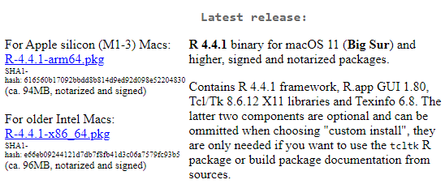

# Introduction to R and R Studio

Welcome to the beginning of your journey into the world of statistical analysis with R and R Studio. This section will introduce you to the fundamental concepts and tools you'll use throughout this course to explore and analyze data.

## What is R?

R is a powerful statistical programming language used widely by statisticians, data scientists, and researchers to analyze and visualize data. It's open source, which means it is free to use, and has a vast community of users and developers who contribute to its continuous development.

 *Screenshot of the R Project homepage, where R can be downloaded.*

### Features of R

- **Statistical Analysis**: Provides a wide array of techniques for data analysis, including linear and nonlinear modeling, classical statistical tests, time-series analysis, classification, clustering, and more.
- **Graphics**: Boasts high-quality graphics capabilities that allow for the creation of well-designed publications and interactive visualizations for the web.
- **Packages**: Comes with a comprehensive ecosystem of packages, available through the Comprehensive R Archive Network (CRAN), which extend R's capabilities to handle tasks related to psychological research and beyond.
- **Programming**: Supports both procedural programming with functions and object-oriented programming with generic functions.
- **Community Support**: Has a large, active community offering support through mailing lists, forums, and blogs.

## What is R Studio?

R Studio is an integrated development environment (IDE) for R. It provides a user-friendly interface that makes using R easier and more efficient. R Studio includes a console, syntax-highlighting editor that supports direct code execution, and tools for plotting, history, debugging, and workspace management.

 *Overview of the R Studio interface.*

### Why Use R Studio?

- **Ease of Use**: The R Studio environment organizes everything you need to write code, visualize data, and debug errors in one place.
- **Productivity Tools**: Features like code completion, snippets, and the ability to directly output graphs enhance productivity.
- **Project Management**: Simplifies the process of managing files associated with specific projects, making it easy to handle multiple, complex research projects.
- **Reproducibility**: Encourages reproducible research by integrating well with R Markdown, which allows you to create dynamic reports that blend R code with narrative text and output.

## R and R Studio in Psychological Research

In psychological research, R and R Studio play a critical role in:
- **Data Collection and Cleaning**: Handling and cleaning raw data from experiments or surveys.
- **Statistical Testing**: Performing t-tests, ANOVA, regression analyses, and more sophisticated statistical models.
- **Data Visualization**: Creating compelling visualizations to explore data trends and communicate results.
- **Reproducible Research**: Producing reproducible analyses that can be shared and verified by others, enhancing the transparency and credibility of research findings.

 *Example of a data visualization created in R.*


In the next sections, we will guide you through installing R and R Studio on your system and begin exploring their capabilities through practical exercises. This foundation will set you up for success as you dive deeper into the statistical techniques and tools that will be covered throughout this course.

## Installing R

To utilize R and R Studio for your statistical analysis, the first step is to install R. R is the underlying statistical computing environment, while R Studio provides an integrated development environment (IDE) for R. Below are the detailed instructions for installing R on Windows and macOS.

### Installing R on Windows

Follow these steps to install R on a Windows computer:

1. **Visit the CRAN Website**: Go to the Comprehensive R Archive Network (CRAN) at [https://cran.r-project.org](https://cran.r-project.org). This website hosts the R software and its documentation.

2. **Download R for Windows**: Click on the link titled "Download R for Windows". This will take you to the Windows download page.

   

3. **Install R Base**: On the download page, click "install R for the first time" to navigate to the base distribution page. There, download the latest version of R by clicking the link at the top of the page.

   

4. **Run the Installer**: Once the download is complete, open the executable file to start the installation process. Follow the prompts in the installer, accepting the default settings for a standard installation.

5. **Complete the Installation**: After following the installation prompts, click 'Finish' to complete the installation.

### Installing R on macOS

Follow these steps to install R on a macOS computer:

1. **Visit the CRAN Website**: Navigate to [https://cran.r-project.org](https://cran.r-project.org) to access the CRAN homepage.

2. **Download R for macOS**: Click on the "Download R for (Mac) OS X" link to go to the macOS download page.

   

3. **Install R Package**: On the macOS download page, select the package suitable for your version of macOS. Click on the link to download the `.pkg` installer file.

   

4. **Run the Installer**: After the download is complete, double-click on the `.pkg` file to open the installer. Follow the on-screen instructions, accepting the default options where suggested.

5. **Complete the Installation**: Proceed through the installer by clicking 'Continue' and then 'Install'. You may need to enter your administrator password. Click 'Finish' once the installation process completes.

### Verify Installation

After installing R on your system, it's a good idea to verify that it was installed correctly:

- **Open R**: Search for R in your applications (Windows) or use Spotlight (macOS) to find and launch R.
- **Check Version**: In the R console, type `version` and press Enter. This will display information about the R version installed on your computer.

```{r, eval=FALSE}
version
```

## Installing R Studio

Once R is installed on your computer, the next step is to install R Studio, which will serve as your primary interface for writing and running R scripts. Here are step-by-step instructions to install R Studio on both Windows and macOS.

### Before You Install

Before installing R Studio, make sure that:
- **R is Installed**: R Studio requires R to be installed on your computer. If you haven't installed R yet, please refer to the previous section for instructions.
- **System Requirements**: Check the R Studio website for the latest system requirements to ensure compatibility with your operating system.

### Installing R Studio on Windows

Follow these steps to install R Studio on a Windows computer:

1. **Download R Studio**: Visit the Posit website at [https://posit.co/download/rstudio-desktop/](https://posit.co/download/rstudio-desktop/) and navigate to the Download R Studio Desktop section. Click on the "Download RStudio Desktop for Windows" button.

   

2. **Run the Installer**: After the download is complete, open the executable file to start the installation process. You may receive a security warning; click 'Run' to proceed.

3. **Follow the Installation Prompts**: The installer will guide you through the setup process. Accept the license agreement and keep the default installation settings unless you have specific preferences.

4. **Complete the Installation**: Click 'Finish' to complete the installation process. R Studio should now be installed on your computer.

### Installing R Studio on macOS

Follow these steps to install R Studio on a macOS computer:

1. **Download R Studio**: Visit the Posit website at [https://posit.co/download/rstudio-desktop/](https://posit.co/download/rstudio-desktop/) and navigate to the Downloads table. Select the macOS linked file to download R Studio Desktop

   

2. **Open the Installer**: After the download, locate the `.dmg` file in your Downloads folder and double-click to open it.

3. **Drag R Studio to Applications**: A new window will open showing the R Studio icon. Drag this icon to your Applications folder to install the application.

4. **Complete the Installation**: Double-click R Studio from your Applications folder to ensure it opens correctly and completes any setup it requires the first time it runs.

### Verify Installation

To verify that R Studio is correctly installed:
- **Launch R Studio**: Open R Studio from your Applications menu (Windows) or your Applications folder (macOS).
- **Check for R Version**: In the R Studio console, you should see the version of R that is being used by R Studio. 

```{r, eval=FALSE}
sessionInfo()  # This will print out your R session information, including R version.

```
